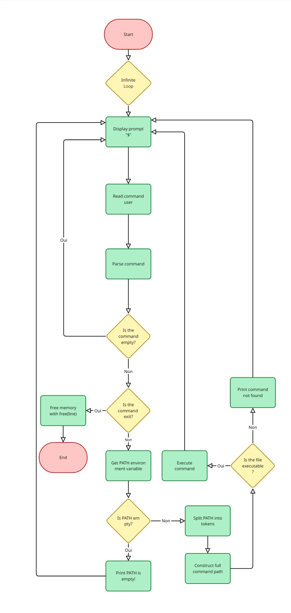

# ***Simple Shell***


## *Description*

**Simple Shell** is a basic Unix-like command-line shell written in C. It supports a limited set of built-in commands and can execute external programs found in the system's PATH.

The program execute the most common with their arguments shell commands such as :
- `ls` ( `-l` or `-a` or `-la` )
- `pwd`
- `env`
- `cat`

The user could stop the program using `exit` or **CTRL + D**


## *Compilation Command*

To compile `simple shell`, use the following commande :

```sh
gcc -Wall -Werror -Wextra -pedantic -std=gnu89 *.c -o hsh
```
## *Requiements*

The project was developped and tested in the following environment: 
- Ubuntu 20.04 LTS
- GCC (GNU Compiler Collection)
- Git for source code management

### *Installation*

Clone the repository and compile the program:
```sh
git clone https://github.com/SR9401/holbertonschool-simple_shell.git
```
```sh
cd holbertonschool-simple_shell
```
```sh
gcc -Wall -Werror -Wextra -pedantic -std=gnu89 *.c -o hsh
```

Run the shell:
```
./hsh
```
## *Exemple*
```sh
juleslgc@VENTURA:~/holbertonschool-simple_shell$ ./hsh
$ ls
fork_exec_wait.c  main.h  mypid   pid.c   av.c  exec.c  find_path.c
$ 
```
```sh
$ ls -la
total 84
drwxr-xr-x 6 SR9401 juleslgc  4096 Apr 21 10:52 .
drwxr-x--- 8 SR9401 juleslgc  4096 Apr 19 17:10 ..
drwxr-xr-x 8 SR9401 juleslgc  4096 Apr 19 17:13 .git
-rw-r--r-- 1 SR9401 juleslgc    86 Apr 21 09:36 AUTHORS
-rw-r--r-- 1 SR9401 juleslgc  1120 Apr 21 10:55 README.md
-rw-r--r-- 1 SR9401 juleslgc   769 Apr 19 17:05 _getenv.c
-rw-r--r-- 1 SR9401 juleslgc   588 Apr 21 10:42 arg.c
drwxr-xr-x 2 SR9401 juleslgc  4096 Apr 21 10:04 test
$ 
```

## *Man Page*

1. **Make sure the man page file is in the project directory**:  
   The **`man_simple_shell`** file should be present in your project directory. If this file is there, you can access it directly.

2. **Open the man page**:  
   You can open the man page by running the following command:
   ```sh
   $ man ./man_simple_shell
   ```

## *Flowchart*

<div align="center">
  
</div>


## *Authors*

[Shakib ROJAS](https://github.com/SR9401) 
&
[Jules VENTURA](https://github.com/Juleslgc)